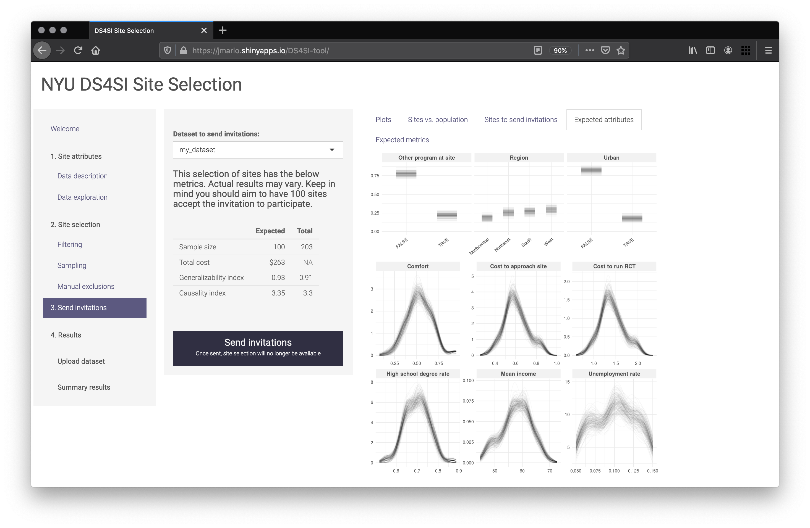

# DS4SI-tool
Pedagogical tool for selecting where to conduct randomized control trials. Built in Shiny.

Live version of the current draft can be found here: [jmarlo.shinyapps.io/DS4SI-tool/](https://jmarlo.shinyapps.io/DS4SI-tool/)

 

 

## Documentation

- /DS4SI-Tool
  - /R
    - `functions.R`: various functions that are used multiple times
    - `ggplot_settings.R`: color and theme settings for ggplot
    - `score_generalizability.RData`: pre-defined score_generalizability() function to be loaded by global.R. This is an .RData file because it contains an underlying empirical distribution
  - /data/`jpta.csv`: dataset of the population of sites
  - /markdowns
    - `data_description.md`: text on the data description page
    - `tool_instructions.md`: text on the tool instructions tab of the landing page
    - `welcome_text.md`: text on the landing page
  - /www/`custom_css.css`: custom CSS that gives the tool its look and feel
  - `global.R`: pre-created R objects that are accessible by both ui.R and server.R
  - `server.R`: the server side calculations
  - `ui.R`: the UI of the tool
- /R
  - `generate_site_selection_data.R`: generates the jpta.csv dataset
  - `score_generalizibility.R`: generates score_generalizability.RData

 

### Naming conventions

|                                                                                                                     | Convention                | Example                      |
|---------------------------------------------------------------------------------------------------------------------|---------------------------|------------------------------|
| UI slider id                                                                                                        | [page]_slider\_[variable] | filtering_slider_comfort     |
| UI select input id                                                                                                  | [page]_select\_[variable] | filtering_select_region      |
| UI button id                                                                                                        | [page]_button\_[name]    | sampling_button_run_sampling |
| UI table id                                                                                                         | [page]_table\_[name]      | sampling_table_excluded      |
| UI plot id                                                                                                          | [page]_plot\_[name]       | filtering_plot_hist          |
| UI select (dropdown) id containing the user's selection for the dataset                                                      | [page]_dataset            | sampling_dataset             |
| The reactive function that returns the dataset object resulting from the user's selection                           | [page]_selected\_data()   | sampling_selected_data()     |
| The reactive function that receives the [page]_selected_data() and returns the modified dataset based on user's input | [page]_data()             | sampling_data()              |
| ...                                                                                                                 |                           |                              |